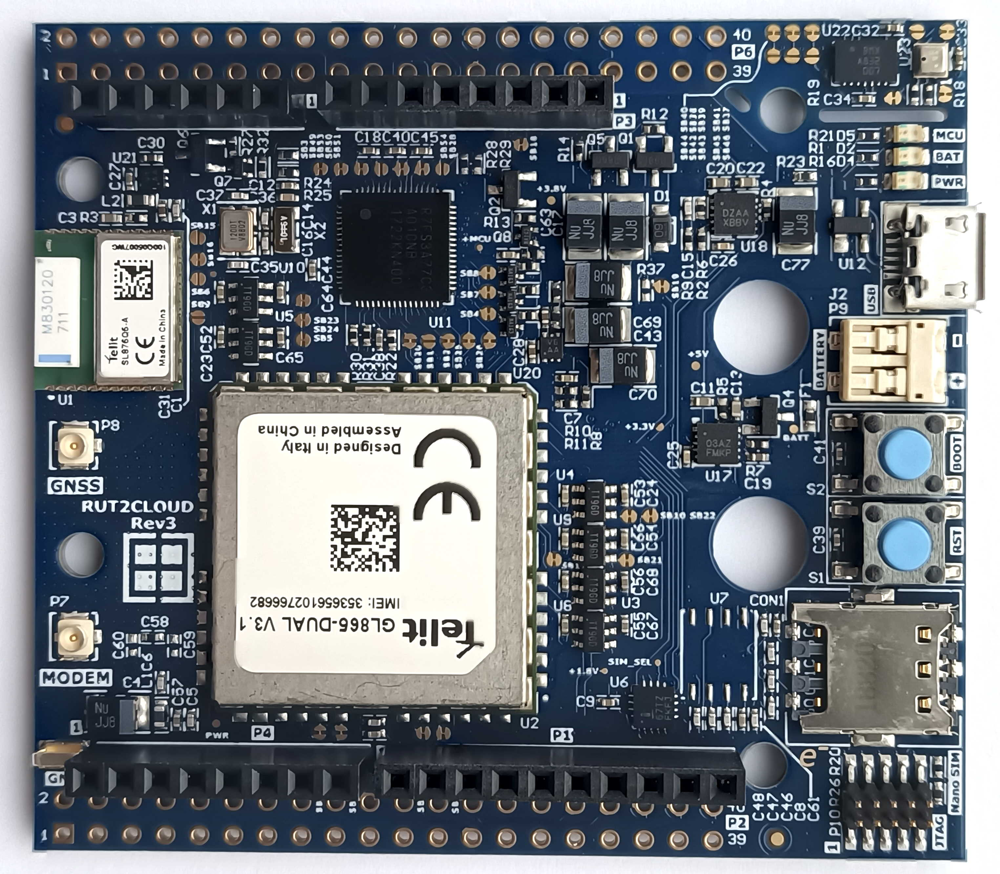

# RUT2CLOUD Evaluation Kit

The RUT2CLOUD evaluation kit has been designed by Rutronik for IoT cloud connectivity projects development and promotion. Low power Renesas Synergy S3A7 MCU and Li-ION battery charger enables the board to be used for portable and battery powered applications. The power source for the Telit modem is switched between USB and battery automatically by the circuit on board. The MCU, modem, GNSS module and sensors might be evaluated independently.

## Features

-  Telit GL865 DUAL V3.1 Cellular Modem (NL865 4G optional).
-  Telit SL876Q5-A GNSS Module.
-  Nano SIM card slot and eSIM (optional).
-  Renesas S3A7 MCU: ARM Cortex-M4F, 1MB Flash, 192KB RAM, 16KB Data Flash, QFN-64 Package.
-  BOSCH Sensors BME280 (temperature, pressure, humidity,) and BMX055 (accelerometer, gyroscope, magnetometer).
-  USB or Battery power source automatic selection.
-  ISL9203A Battery charger 1.5A Li-ion.
-  ISL80103 LDO 3A.
-  ISL9021AIRUNZ LDO 250mA 3.3V.
- ISL9021AIRUCZ LDO 250mA 1.8V. 
-  ISL84467 Quad SPDT Analog Switch.
-  Micro USB 2.0 Full-Speed connectivity.
-  U.FL Sockets for cellular modem and GNSS module’s external antenna.
-  Molex Mini Lite-Trap battery connector.
-  ARM JTAG Header: 10-pin, 1.27mm pitch, 2 rows.

## Legal Disclaimer

The evaluation board including the software is for testing purposes only and, because it has limited functions and limited resilience, is not suitable for permanent use under real conditions. If the evaluation board is nevertheless used under real conditions, this is done at one’s responsibility; any liability of Rutronik is insofar excluded. 

